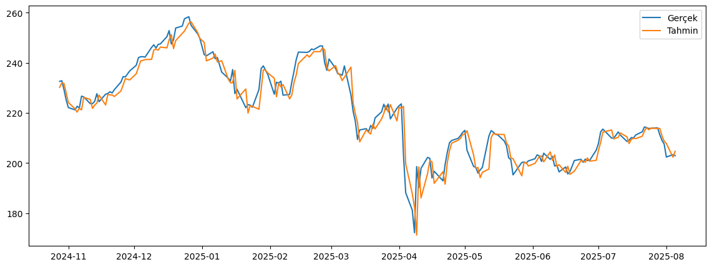

# Borsa Fiyat Tahmin Modeli

Bu proje, Apple (`AAPL`) hisse senedi verileri üzerinde `LSTM` tabanli bir zaman serisi tahmin modeli egitmek icin hazirlanmistir. Model, Yahoo Finance uzerinden cekilen gecmis fiyat verilerini kullanarak kapanis (`Close`) fiyatini tahmin eder.

Proje klasorunde egitim kodu, egitilmis model dosyasi ve tahmin sonucunu gosteren grafik yer almaktadir.

## Proje Amaci

Amaç, gecmis borsa verilerini kullanarak derin ogrenme tabanli bir yaklasimla kisa vadeli fiyat tahmini yapmaktir. Model:

- `Open`
- `High`
- `Low`
- `Close`
- `Volume`

degiskenlerini girdi olarak kullanir ve hedef olarak `Close` fiyatini tahmin eder.

## Kullanilan Teknolojiler

- Python
- TensorFlow / Keras
- NumPy
- Pandas
- scikit-learn
- Matplotlib
- yfinance

## Proje Yapisi

```text
.
├── stock_price_forecasting_with_lstm.py
├── model.h5
├── egitim_cikti_grafigi.png
├── requirements.txt
└── .gitignore
```

## Model Akisi

1. `yfinance` ile `AAPL` icin gunluk borsa verileri cekilir.
2. `Open`, `High`, `Low`, `Close`, `Volume` sutunlari secilir.
3. Verinin son yaklasik `252` islem gunu test verisi olarak ayrilir.
4. Veriler `MinMaxScaler` ile olceklendirilir.
5. `look_back = 60` olacak sekilde zaman pencereleri olusturulur.
6. Tek katmanli bir `LSTM(64)` modeli kurulur.
7. Model `100` epoch boyunca egitilir.
8. Test verisi uzerinde tahmin yapilir.
9. Tahminler gercek fiyatlarla birlikte grafik uzerinde gosterilir.

## Model Mimarisi

Kodda kullanilan temel mimari:

```python
model = Sequential()
model.add(LSTM(64, input_shape=(look_back, X_train.shape[2])))
model.add(Dense(1))
model.compile(optimizer='adam', loss='mse')
```

Bu yapi, cok degiskenli zaman serisi girdilerini kullanarak bir sonraki kapanis fiyatini tahmin etmek icin tasarlanmistir.

## Kurulum

### 1. Ortami hazirlayin

```bash
python -m venv .venv
source .venv/bin/activate
```

Windows PowerShell icin:

```powershell
.venv\Scripts\Activate.ps1
```

### 2. Bagimliliklari yukleyin

```bash
pip install -r requirements.txt
```

## Calistirma

Projeyi calistirmak icin:

```bash
python stock_price_forecasting_with_lstm.py
```

Kod calistiginda:

- Yahoo Finance uzerinden veri cekilir
- Model egitilir
- Test tahminleri uretilir
- Performans metrikleri terminale yazdirilir
- Grafik ekranda gosterilir
- Egitilen model `model.h5` olarak kaydedilir

## Ornek Cikti

Proje klasorunde bulunan asagidaki gorsel, model tahminlerinin gercek fiyatlarla karsilastirilmasini gostermektedir:

Asagida dogrudan onizleme de yer almaktadir:



## Dosya Aciklamalari

### `stock_price_forecasting_with_lstm.py`

Modelin tum egitim, tahmin, gorsellestirme ve kaydetme adimlarini icerir.

### `model.h5`

Egitim sonrasinda kaydedilen Keras model dosyasidir.

### `egitim_cikti_grafigi.png`

Gercek ve tahmin edilen kapanis fiyatlarini gosteren cikti grafigidir.

## Notlar

- Kod, Google Colab uzerinden disa aktarilmis bir Python dosyasina dayanmaktadir.
- Veri kaynagi internet baglantisi gerektirir, cunku fiyat verileri calisma aninda Yahoo Finance'tan cekilir.
- `model.h5` dosyasi mevcut egitilmis modeli saklar; istenirse daha sonra yuklenip tekrar kullanilabilir.

## Gelistirme Fikirleri

- Farkli hisseler icin parametre destegi eklemek
- `EarlyStopping` ve `Dropout` kullanmak
- Daha fazla performans metrigi eklemek
- Komut satiri argumanlari ile hisse kodu, epoch ve pencere boyutu ayarlanabilir hale getirmek
- Notebook ve moduler Python yapisi olarak ayirmak

